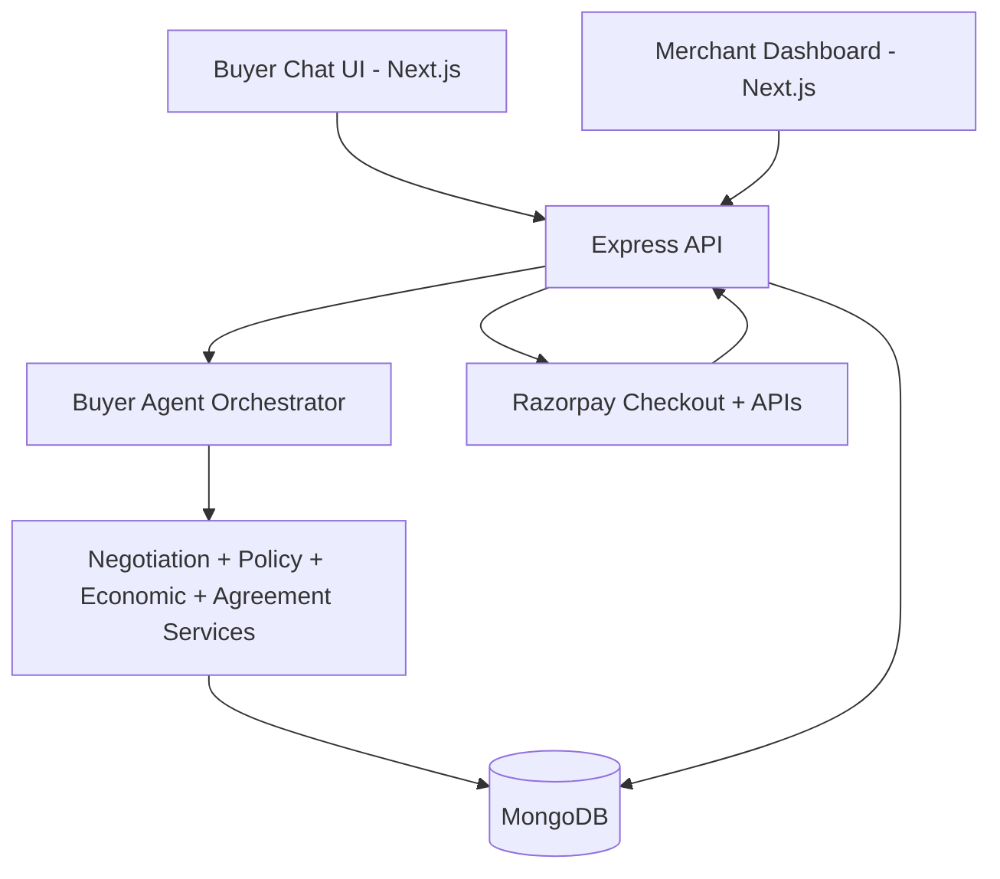

# Agentic Commerce — AI Buyer to Payment

An end-to-end agentic commerce platform where AI buyers can discover products, negotiate within merchant-defined policies, complete Razorpay payments, and trigger real inventory updates.

## 1) Project Title

**Agentic Commerce — AI Buyer to Payment**

An end-to-end agentic commerce platform where AI buyers can discover products, negotiate within merchant-defined policies, complete Razorpay payments, and trigger real inventory updates.

## 2) Hackathon Track

**AI Growth & Agentic Commerce**

This project demonstrates a merchant becoming truly transactable by an AI buyer:
- AI-driven product discovery from a real catalog
- Policy-bounded negotiation (discount, margin, quantity, order value, rounds, shipping threshold)
- Agreement and approval gating before checkout
- Razorpay order creation + signature verification on the backend
- Authoritative inventory deduction after verified payment
- Merchant-scoped audit trail across negotiation, policy, agreement, payment, and inventory events

## 3) Problem

Traditional commerce systems allow AI assistants to recommend products, but often fail at safe transaction completion.  
Merchants need enforceable control over negotiation behavior, and financial actions must be deterministic, bounded, and traceable from buyer intent to inventory consequence.

## 4) Solution

This repository implements a full buyer-to-payment flow:

**Buyer intent → Product discovery → Product selection → Negotiation → Policy/economic evaluation → Agreement → Approval gate → Razorpay payment → Signature verification → Inventory update → Audit events**

- The **buyer agent** handles conversational shopping and workflow orchestration.
- The **merchant-side agent logic** is enforced through deterministic policy, economics, and negotiation services (not unconstrained LLM decisions).

## 5) Key Features

### AI Buyer
- Conversational product search (`/api/agents/buyer/chat`)
- Product selection from search results
- Negotiation start / offer submission / offer acceptance
- Shipping/free-delivery query handling based on policy threshold
- Place Order and View Order Status actions
- Pay Now action integrated with Razorpay Checkout
- Conversation persistence with server-side buyer state

### Merchant Controls
- Merchant auth and role-based access
- Agent enable/disable and agent description controls
- Negotiation policy configuration:
  - max discount %
  - minimum margin %
  - max quantity per order
  - min/max order value
  - auto-approval toggle + limit
  - free shipping threshold
  - max negotiation rounds
  - allowed currencies

### Commerce Data & Lifecycle
- Product catalog CRUD with negotiability and specifications map
- Negotiation lifecycle (`ACTIVE`, `ACCEPTED`, `REJECTED`, `EXPIRED`)
- Agreement lifecycle (`PENDING_APPROVAL`, `APPROVED`, `REJECTED`, `COMPLETED`, etc.)
- Approval records for manual merchant approval path

### Payments (Razorpay)
- Server-side payment order creation
- Backend-authoritative amount calculation
- Reuse of existing pending Razorpay order (idempotent path)
- Server-side HMAC signature verification
- Order ID mismatch protection
- Payment status tracking (`RAZORPAY_ORDER_CREATED` → `VERIFIED` → `CAPTURED`)
- Agreement completion after successful capture

### Inventory & Auditability
- Pre-payment inventory readiness checks
- Atomic inventory decrement after successful verification
- Out-of-stock transition handling
- Merchant-scoped audit logs with category and date/search filters
- Audit events for negotiation, policy evaluation, agreement, payment, inventory, and failure paths

## 6) Architecture



### Layer responsibilities
- **Frontend (Next.js):** Buyer chat, merchant operations (products, agent policy, negotiations, orders, audit logs).
- **Backend API (Express + TypeScript):** Auth, catalog, policy, negotiation, agreement, approvals, payments, audit endpoints.
- **Agent/business layer:** Intent normalization + deterministic commerce engines and stateful action handling.
- **MongoDB:** Source of truth for users, merchants, products, policies, negotiations, agreements, approvals, payments, conversations, audit events.
- **Razorpay:** Checkout + payment order/capture verification.

## 7) Tech Stack

- **Frontend:** Next.js 16, React 19, TypeScript, Tailwind CSS, shadcn/ui
- **Backend:** Node.js, Express 5, TypeScript, Mongoose, Zod
- **Auth:** JWT (HTTP-only cookie with Authorization header fallback)
- **Payments:** Razorpay
- **LLM Providers:** OpenRouter (default), Gemini (fallback-capable integration)

## 8) Core Data Models

- `User` (BUYER / MERCHANT role, linked merchant/buyer IDs)
- `Merchant` (profile + `agentEnabled`, `agentDescription`)
- `Product` (price, costPrice, inventory, negotiability, specifications map)
- `Policy` (all merchant negotiation and approval bounds)
- `Negotiation` (round history, offers, status)
- `Agreement` (agreed terms and approval/payment readiness state)
- `Approval` (manual review record when auto-approval does not apply)
- `Payment` (Razorpay IDs, status, inventoryAdjusted flag)
- `Conversation` (buyer state machine + message history, expirable session)
- `AuditEvent` (merchant-scoped event timeline)

## 9) API Overview

Base URL: `http://localhost:5000`

- `GET /api/health`
- `POST /api/auth/register/buyer`
- `POST /api/auth/register/merchant`
- `POST /api/auth/login`
- `POST /api/auth/logout`
- `GET /api/auth/me`
- `POST /api/agents/buyer/chat`
- `GET/POST/PUT/DELETE /api/products`
- `GET/POST/PUT/DELETE /api/policies`
- `GET/POST /api/negotiations` (+ offer/accept/reject actions)
- `GET/POST /api/agreements` (+ approve/reject/explanation/payment-ready/audit)
- `GET/POST /api/approvals`
- `POST /api/payments/create-order`
- `POST /api/payments/verify`
- `GET /api/payments/agreement/:agreementId`
- `GET /api/audit-logs` (alias of audit-events route)

## 10) Frontend Pages

- `/` buyer chat and checkout flow
- `/buyer` role-selection landing page
- `/buyer/login`, `/buyer/register`
- `/merchant/products` catalog management
- `/merchant/agent-builder` policy and agent controls
- `/merchant/agent-builder/test` embedded buyer-agent test chat
- `/merchant/negotiations` + `/merchant/negotiations/:id`
- `/merchant/orders` + `/merchant/orders/:id`
- `/merchant/audit-logs`
- `/merchant/analytics` (placeholder)
- `/merchant/settings` (placeholder)

## 11) Local Setup

### Prerequisites
- Node.js (LTS)
- MongoDB running locally

### Backend
```bash
cd /home/runner/work/razorpay_hackthon/razorpay_hackthon/server
cp .env.example .env
npm install
npm run dev
```

Required env vars (server):
- `MONGODB_URI`
- `RAZORPAY_KEY_ID`
- `RAZORPAY_KEY_SECRET`
- `JWT_SECRET`
- Optional LLM: `OPENROUTER_API_KEY`, `GEMINI_API_KEY`, `LLM_PROVIDER`

### Frontend
```bash
cd /home/runner/work/razorpay_hackthon/razorpay_hackthon/frontend
npm install
NEXT_PUBLIC_API_URL=http://localhost:5000 npm run dev
```

## 12) Test Commands

Backend:
```bash
cd /home/runner/work/razorpay_hackthon/razorpay_hackthon/server
npm test
```

Frontend:
```bash
cd /home/runner/work/razorpay_hackthon/razorpay_hackthon/frontend
npm test
npm run lint
```
